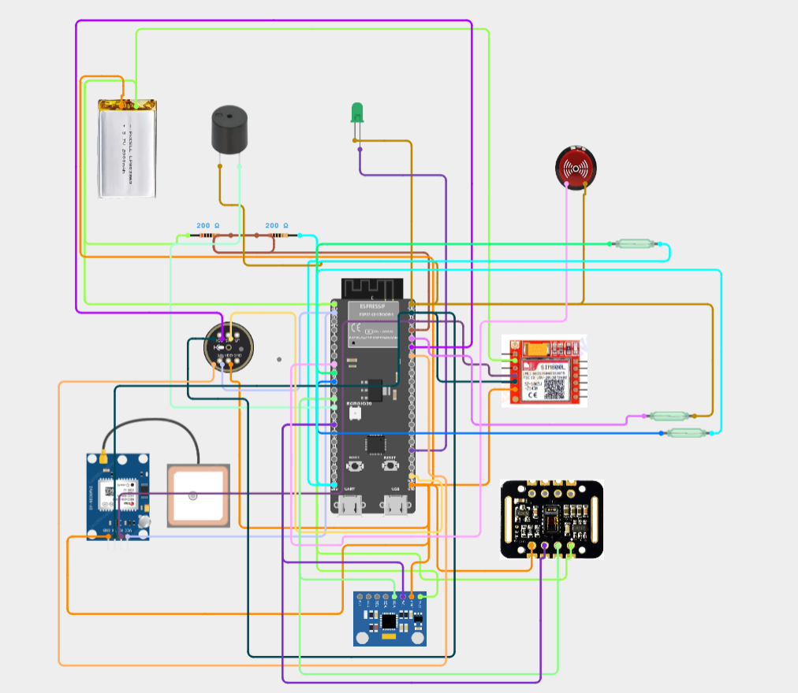

# 🛡️ Raksha Band - Smart Wearable Safety & Emergency Bracelet

[](https://www.espressif.com/)
[](https://www.waveshare.com/)
[](LICENSE)
[]()

**Raksha Band** is an ultra-compact, wearable emergency safety bracelet engineered for personal protection. Powered by an **ESP32-C3** microcontroller, **SIM7000E** LTE-M/NB-IoT + GNSS GPS module, **LIS3DH** 3-axis accelerometer, magnetic reed switch, vibration motor, and Bluetooth Low Energy (BLE) mobile app connectivity.

---

## 🖼️ Final Circuit Diagram & Connection Guide



*Figure 1: Complete hardware circuit schematic including ESP32-C3 SuperMini, SIM7000E cellular/GNSS module, LIS3DH accelerometer, Reed switch trigger, physical Bluetooth ON/OFF switch, NPN transistor vibration motor driver, status LED, and TP4056 + DW01A battery protection circuit.*

---

## ✨ Key Features

- 🛰️ **Cellular SMS & Real-Time GNSS GPS Tracking**: Automatically powers on SIM7000E, acquires satellite location, and dispatches SMS alerts with Google Maps coordinates.
- ⚡ **Physical Bluetooth ON/OFF Switch (`GPIO 0`)**: Dedicated hardware switch turns BLE radio ON for app sync or OFF to preserve battery.
- 🤖 **Smart Motion Classification (LIS3DH)**:
  - **Fall Impact + Stillness**: Detects high-g shock (> 3.2G) followed by post-impact stillness.
  - **Violent Struggle / Attack**: Detects erratic multi-axis acceleration variance sustained for > 800ms.
- 🧲 **Dual-Mode Magnetic Reed Switch (`GPIO 2`)**:
  - **Discreet Magnet SOS**: Swipe a magnet ring/fob across bracelet to silently trigger alert.
  - **Clasp Tamper Detection**: Triggers alert if bracelet is forcibly pulled off.
- ⏱️ **20-Second False Alarm Cancellation Window**: Haptic vibration + LED visual warnings allow canceling accidental triggers before SMS dispatch.
- 🔋 **Battery Protection & Deep Sleep**: TP4056 + DW01A protection IC safely charges small 150mAh LiPo cells; MCU sleeps in µA mode with instant hardware interrupts.

---

## 📌 Bill of Materials (BOM) & Pin Connections

| # | Part | Function | ESP32-C3 Pin | Wiring Notes |
|---|---|---|---|---|
| 1 | **ESP32-C3 SuperMini / MINI-1** | Core Microcontroller | — | RISC-V 160MHz, BLE 5.0, deep sleep controller |
| 2 | **SIM7000E Module** | Cellular SOS & GNSS GPS | **GPIO 4 (TX)** / **GPIO 5 (RX)** | ESP32 TX (`GPIO 4`) → SIM7000E RXD; RX (`GPIO 5`) → TXD |
| 3 | **SIM7000E PWRKEY** | Power Key Control | **GPIO 3** | Pulse LOW (~1s) to boot/wake cellular modem |
| 4 | **LIS3DH Accelerometer** | Motion & Fall Sensor | **GPIO 8 (SDA)** / **GPIO 9 (SCL)** | I2C Bus (`0x18` / `0x19`). Ties CS & VDD_IO to 3.3V |
| 5 | **LIS3DH INT1** | Motion Wake Interrupt | **GPIO 7** | Connected to LIS3DH INT1 pin to wake MCU from sleep |
| 6 | **Reed Switch** | Magnet SOS / Clasp Sensor | **GPIO 2** | `INPUT_PULLUP`. Active LOW magnet swipe / Active HIGH tamper |
| 7 | **Bluetooth Switch** | Physical BT Radio Toggle | **GPIO 0** | `INPUT_PULLUP`. Active LOW: BT ON, HIGH: BT OFF |
| 8 | **Vibration Motor** | Silent Haptic Alert | **GPIO 6** | Low-side NPN transistor driver (MMBT2222A) with 10kΩ base resistor & 1N4148 diode |
| 9 | **Status LED / Buzzer** | Visual/Sound Indicator | **GPIO 10** | Series 330Ω resistor to LED anode (+). Cathode to GND |
| 10 | **Battery Voltage Sense** | Battery Level Sense | **GPIO 1** | Analog ADC reading 3.7V LiPo voltage via divider |
| 11 | **TP4056 + DW01A IC** | Charger & Protection | System Rail | Charges LiPo & prevents over-charge/discharge/short-circuit |
| 12 | **3.7V 150mAh LiPo** | Power Source | BAT+ / BAT- | Curved 1.5–2mm thin LiPo cell |

---

## ⚡ Circuit Architecture & Power Flow

```
                           ┌─────────────────────────────┐
                           │   3.7V 150mAh LiPo Cell     │
                           └──────────────┬──────────────┘
                                          │
                                          ▼
                           ┌─────────────────────────────┐
                           │  TP4056 + DW01A Protection  │
                           └──────────────┬──────────────┘
                                          │
                                  System Rail (OUT+/OUT-)
                                          │
                   ┌──────────────────────┴──────────────────────┐
                   ▼                                             ▼
       ESP32-C3 Power Rail (3V3/5V)                     SIM7000E VCC Rail
    (MCU, LIS3DH, LED, Vibro Motor)              (Direct Battery Rail Connection)
```

---

## 🔄 Real-Life Operating Flowchart

```
                        ┌────────────────────────┐
                        │       IDLE MODE        │
                        │ (Ultra Low-Power Sleep)│
                        └───────────┬────────────┘
                                    │
             [Trigger: Reed Switch / Fall Impact / Struggle / App]
                                    │
                                    ▼
                        ┌────────────────────────┐
                        │ 20s CANCEL COUNTDOWN   │
                        │ (Vibrates & LED Flash) │
                        └───────────┬────────────┘
                                    │
                      ┌─────────────┴─────────────┐
                      │                           │
          [User Magnet Swipe / App Cancel]   [20 Seconds Elapse]
                      │                           │
                      ▼                           ▼
          ┌───────────────────────┐   ┌───────────────────────┐
          │   ALERT CANCELLED     │   │ DISPATCH SOS VIA SMS  │
          │   (Return to Idle)    │   │ (Get GPS & Send Text) │
          └───────────────────────┘   └───────────┬───────────┘
                                                  │
                                                  ▼
                                      ┌───────────────────────┐
                                      │   BEACON ALARM MODE   │
                                      │ (Periodic Warning Pulse)│
                                      └───────────────────────┘
```

---

## 📱 Bluetooth Low Energy (BLE) App GATT API

- **Service UUID**: `4fafc201-1fb5-459e-8fcc-c5c9c331914b`
- **Characteristics**:
  - **Device Serial** (`e376a1c4-1122-48cb-9966-5197825e364e`): Read unique serial (`RAKSHA-C3-XXXX`).
  - **Emergency Phone Number** (`1c95d5e3-04b7-4173-9f08-60b24016a20d`): Read/Write phone number stored in NVS flash memory.
  - **Battery Percentage** (`beb5483e-36e1-4688-b7f5-ea07361b26a8`): Read/Notify live battery % (0–100%).
  - **Alert Command** (`d292a031-6b80-494d-8d45-7171082c3c47`): Write `"TRIGGER"` to start manual SOS, or `"CANCEL"` during 20s window.

---

## 📄 License

This project is open-source software licensed under the **MIT License**.
